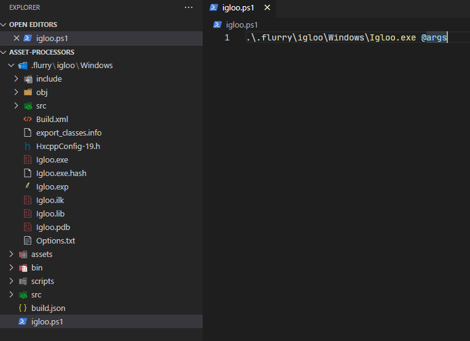
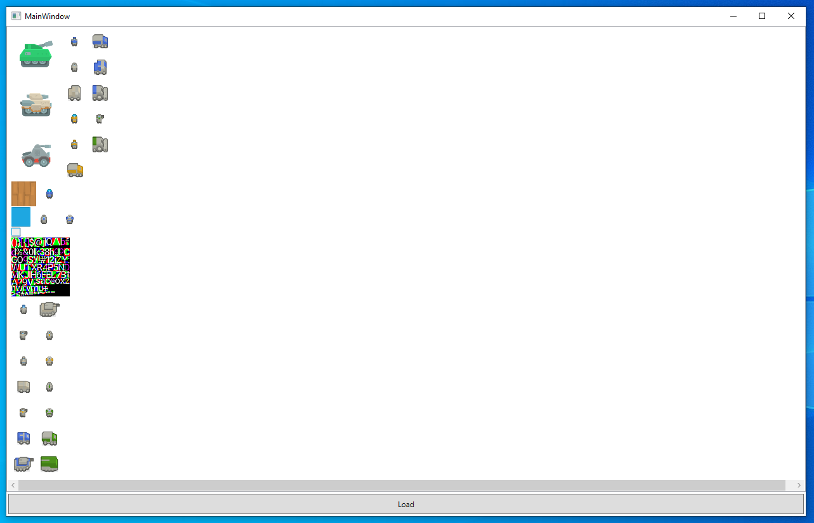

For the last few weeks, I’ve been rebuilding my game engine’s build tool after becoming increasingly frustrated at how inflexible the asset pipeline was as some of my projects started to grow or had unusual asset processing requirements. The build tool in its entirety could be split into two main parts. The asset pipeline, where assets are serialised into files called “parcels” which are loaded by the engine. And the code generator, which is responsible for creating haxe hxml files, invoking the haxe compiler, and auto running the game if everything was successful. This article focuses on the overhaul to the asset pipeline stage of this tool, which I've named `Igloo`. 

My engine was initially heavily inspired by the old luxe alpha and the general structure of the asset pipeline was taken from there. In the existing solution assets are defined in json files and then serialised into files called parcels. The json files use the format below.

```json
{
    "assets" : {
        "bytes"  : [],
        "texts"  : [],
        "fonts"  : [
            { "id" : "roboto", "path" : "fonts/Roboto-Regular.ttf" }
        ],
        "sheets" : [],
        "sprites" : [],
        "images" : [
            { "id" : "tank1", "path" : "images/tank1.png" },
            { "id" : "tank2", "path" : "images/tank2.png" },
            { "id" : "tank3", "path" : "images/tank3.png" },
        ],
        "shaders" : [
            {
                "id" : "textured",
                "vertex" : "shaders/textured.vert.glsl",
                "fragment" : "shaders/textured.frag.glsl"
            }
        ]
    },
    "parcels" : [
        {
            "name"    : "preload",
            "images"  : [ "tank1", "tank2", "tank3"  ],
            "fonts"   : [ "roboto" ],
            "shaders" : [ "textured" ]
        }
    ]
}
```

As you can see there are a finite number of hard coded asset types. If the asset you want to include doesn’t fit into one of those six types, then you must bodge it to make it fit. 

This usually means putting the asset in the “bytes” category and parsing it at game runtime. This isn’t great as often the assets are editor formats (e.g., tiled xml files, aseprite files, etc) which are large and slow to parse. Adding more types to the pipeline also isn’t ideal, especially in the case of generic map files such as tiled. The expected tile layers, object layers, etc in a map for one project might differ substantially from another, so with generic tiled support we’re back to doing a lot of the work at game runtime. 

The solution envisioned of was to have the pipeline be extensible by user written scripts. These “asset processors” would register themselves as wanting to operate on specific file types, read those editor formats at compile time, and write only the data we’re interested into the parcel. This would allow projects to serialise assets to fit their exact needs instead of trying to make one size fits all solutions. 

XNA / Monogame has a similar system, their content pipeline tool can be extended with C# dlls allowing users to write custom processors for any assets they require.

## Potential Haxe Solutions

The existing build tool was compiled as a Neko “run.n” file which was invoked through haxelib to build assets and code for a given project. Initially I investigated a plugin system where extra Neko module would be dynamically loaded, this seemed like it could work as Neko appears to support loading extra modules at runtime. 

Ultimately, I decided against Neko as performance was also another area I wanted to improve. In the existing tool the more intensive parts of parcel generation (such as building texture atlases) was being passed off to pre-compiled HXCPP programs to get a good speed and to use existing native libraries. Even with some work being passed off to native executables the whole parcel generation was slower than I’d like. 

Hashlink was another avenue I briefly explored before moving on, at the time of writing hashlink doesn’t appear to have any way to load extra code at runtime. 

What I decided to go with was HXCPP with cppia scripting. Cppia is probably the least used haxe target with little documentation but seemed ideal for my needs. When you compile a haxe program with the cppia target you get a file with a byte code like contents, HXCPP programs can load these cppia scripts and execute them, or load and instantiate classes compiled within the script. 

One of the interesting things about cppia scripts is when compiling them you can link them against an existing HXCPP program (assuming it was compiled with –D scriptable), this means if you reference classes which are compiled into the HXCPP host it won’t include them in the script. This allows you to put the performance intensive parts of the program into the HXCPP host allowing you to get the best of both worlds with regards to performance and access to native libraries and the flexibility of loading scripts at runtime. 

## Overview of the New System

The parcels and the assets to place in them are still defined in json files, but the specific types have been entirely removed. All source assets are defined in a json array. 

```json
{
    "assets" : [
        { "id" : "tank1", "path" : "images/tank1.png" },
        { "id" : "tank2", "path" : "images/tank2.png" },
        { "id" : "tank3", "path" : "images/tank3.png" },
        { "id" : "textured", "path" : "shaders/textured.glsl" },
        { "id" : "roboto", "path" : "fonts/Roboto-Regular.ttf" },
    ],
    "parcels" : [
        { "name" : "preload", "assets" : [ "tank1", "tank2", "tank3", "roboto", "textured" ] }
    ]
}
```

The projects main build file now allows you to specify haxe files which will be compiled into cppia scripts. The script must define a class which extends `igloo.processors.AssetProcessor<T>` which has the same name as the script file. The optional flags field in the json allows you to add extra haxe arguments for compiling the processor. 

```json
{
    "app" : {
        "name"      : "Project",
        "main"      : "Main",
        "output"    : "bin",
        "codepaths" : [ "src" ],
        "author"    : "Aidan Lee",
        "backend"   : "Sdl"
    },
    "build" : {
        "processors" : [
            { "script" : "scripts/MyCustomProcessor.hx", "flags" : "-D extra-haxe-args" }
        ]
    },
    "parcels" : [ "assets/assets.json" ]
}
```

The `AssetProcessor` type has the following signature. 

```haxe
class AssetProcessor<T>
{
    public function ids() : Array<String>;

    public function pack(_ctx : ParcelContext, _asset : Asset) : ResourceRequest<T>;

    public function write(_ctx : ParcelContext, _writer : Output, _data : T, _response : ResourceResponse) : Void;
}
```

> Eventually this will be one of the new haxe 4.2 abstract classes to ensure these functions are implemented. Currently abstract classes are not supported on cppia so for now its a bog standard class.

The `ids` function returns an array of strings for file extensions which the processor will operate on. 

The `pack` function takes in those source assets defined in the json files and returns 1...N resource requests. This allows each source asset to produce multiple output resources for the parcel, each request can also specify if it wants to be packed into a texture atlas. This means any processor can gain all the benefit of build time texture packing instead of it being reserved for special built-in types or being done at game runtime. 

Each of these generated resource requests are resolved by the build tool (i.e., packing them in an atlas if they requested in) then the passed into the `write` function of the same processor. The output object of the `write` function is where you send your custom data into the parcel stream. 

The `AssetProcessor` type is generic, the purpose of this is to allow data to be passed between the pack and write functions for a particular asset and its generated resource requests. Each `AssetProcessor` is only created once and is shared between multiple assets. 

```haxe
import haxe.Exception;
import haxe.io.Output;
import igloo.utils.Unit;
import igloo.parcels.Asset;
import igloo.parcels.ParcelContext;
import igloo.processors.RequestType;
import igloo.processors.AssetProcessor;
import igloo.processors.ResourceRequest;
import igloo.processors.ResourceResponse;

class ImageResourceProcessor extends AssetProcessor<Unit>
{
	override public function ids()
	{
		return [ 'png', 'jpg', 'jpeg', 'tga', 'bmp' ];
	}

	override public function pack(_ctx : ParcelContext, _asset : Asset)
	{
		final absPath = _ctx.assetDirectory.join(_asset.path);
		
		return new ResourceRequest(Unit.value, PackImage(_asset.id, absPath));
	}

	override public function write(_ctx : ParcelContext, _writer : Output, _data : Unit, _response : ResourceResponse)
	{
		switch _response
		{
			case Packed(frame):
                // `id` and `pageID` are project unique integers given to each resource and page.
				_writer.writeInt32(frame.id);
				_writer.writeInt32(frame.pageID);
		
				// Write pixel location of the frame in the page.
				_writer.writeInt32(frame.x);
				_writer.writeInt32(frame.y);
				_writer.writeInt32(frame.w);
				_writer.writeInt32(frame.h);
		
                // Write UV information for the packed frame.
				_writer.writeFloat(frame.u1);
				_writer.writeFloat(frame.v1);
				_writer.writeFloat(frame.u2);
				_writer.writeFloat(frame.v2);
			case NotPacked(_, _):
				throw new Exception('ImageResourceProcessor can only operate on packed responses');
		}
	}
}
```

A complete processor is shown above. This processor operates on image files, for each source asset it produces one resource request to pack the image into the texture atlas. The pixel coordinates, uv coordinates, unique ID, and page ID for the image is written into the parcel stream in the `write` function.

## Scriptable Build Tool

### Bootstrapping

With the build tool being a native program the Neko program invoked through haxelib is now responsible for bootstrapping that program for projects. Calling “haxelib run flurry install” will compile the build tool into a “.flurry” folder in the calling directory and create a PowerShell or bash script for easily invoking it. 



By using the `dll_export` path you can control the location of the metadata file the compiler will produce which contains information on all classes compiled into the cppia host. The path of this file along with the source code path of the build tool is baked into the executable as it is read back at runtime and passed to the haxe compiler when compiling asset processor scripts. When compiling cppia scripts the `dll_import` define can be used to point to a host metadata file to avoid including classes which already exist in the host. 

> DCE should be disabled when compiling a cppia host, if you don’t do this then the metadata file produced could contain classes which were eliminated by the DCE (especially true with the std library), forgetting to do this can lead to linking errors when trying to run your cppia scripts. 

### Compiling Scripts

The first stage of the asset pipeline is to load all scripts and create an instance of each asset processor. Apart from the scripts specified in the project build file, there are a handful of built-in processor scripts which handle basic assets like images and shaders out the box. 

The scripts are compiled by invoking haxe and setting a handful of code paths (the directory the script is in and the path to the source code path the tool was bootstrapped from) and passing any requested flags. 

Each compiled cppia script is cached and a metadata file is generated containing the timestamp when it was built along with all the command line flags used to compiled said script. This is used on subsequent runs to potentially skip this compilation stage. If a scripts modification date is less than the timestamp in the metadata file and the command line arguments match, then the script has not been modified since it was compiled so does not need compiling again. 

Using `cpp.cppia.Module.fromData` these compiled cppia scripts are then loaded into individual modules, using the `resolveClass` function we can get a `Class<T>` for each script processor and construct an instance of it using `Type.createInstance`. This step is why the class which extends `igloo.processor.AssetProcessor` must have the same name as the script and not be in any package, the file name is used for the `resolveClass` call. 

> For anyone using cppia modules make sure you call the “boot” function on them! I spent an entire afternoon trying to figure out why all statics in my cppia scripts were null, turns out the boot function is responsible for setting their initial values.

All these created `AssetProcessor` instances are added into a map where they keys are the strings returned by each processor's `ids` function. If multiple processors both want to load assets with the same extension this is logged and the latest one replaces the existing. 

> Since the haxe compiler is only single threaded and each script is independent of each other, this compiling, loading, and instantiation processor for each script is a prime target for multithreading. The [haxe-concurrent](https://lib.haxe.org/p/haxe-concurrent/) library is used to provide a task pool for concurrent processor loading which gives a significant speed up on fresh project builds or builds where lots of cached scripts were invalidated. 

## Packaging Parcels

### Resource Requests

Once all the resource requests have been generated by the `pack` calls to processors these requests are then transformed into resource responses. Each response is given a project unique integer ID (increments from 0), the ID of the asset processor used generate that request is stored as well. 

If the request stated that it contains data which wants to be placed into the texture atlas, then a rectangle large enough to fit the data is packed into the atlas using the [binpacking](https://lib.haxe.org/p/bin-packing/) haxelib library. The position of the rectangle within the atlas is also stored in the response. 

### Atlas Page Generation

The atlas may have multiple “pages” to it, each page will be generated as a separate texture. When it fails to pack a rectangle into the current page a new page is created to fit that rectangle. Once all requests have been resolved no more rectangles will be inserted into the atlas so the pages can be generated. For each page a `haxe.io.Bytes` object is allocated and all data which was packed within is copied into its appropriate position by checking against the requests packed rectangle. 

This is another area which benifits from concurrency. Each page is unique and by throwing the page generation functions onto a threadpool we get a nice speedup for atlases which have many pages (we could go one step further and throw all individual frames onto a threadpool, but I haven't profiled that yet). 



> The above is a very basic WPF program to display all pages contained within a parcel. The screenshot shows the result of loose images, pre packed texture atlases, and a dynamically generated atlas all packed into a single page.

### Writing Responses

With all pages output into the parcel stream, all the created resource responses are passed into the `write` function of the processor which originally generated them. The unique ID given, the generic data `T` from the `pack` function, and the location of the packed rectangle (if originally requested) are also passed into this function. 

In the parcel stream the `RESR` magic bytes are written along with the string id of the processor used just before calling the `write` function. This allows the engines parcel reader to pass off reading to the appropriate loader when coming across the magic bytes in the stream. 

## Caching

### Invalidation

Once all data has been written to the parcel stream the produced parcel is cached and a json metadata file is stored alongside it. This metadata file is used to check if the parcel is still valid on subsequent builds, if the parcel is not invalidated then the entire packaging stage previously described can be skipped, and the cached parcel reused. 

```json
{
    "timeGenerated": 1626805396370,
    "gpuApi": "d3d11",
    "processorsInvolved": [
        "ImageResourceProcessor",
        "GdxSpriteSheetProcessor"
    ],
    "pages": [
        {
            "id": 0,
            "pos": 5,
            "length": 840581,
            "width": 4096,
            "height": 4096
        }
    ],
    "assets": [
        {
            "name": "tank1",
            "produced": [
                {
                    "name": "tank1",
                    "id": 1,
                    "pos": 846553,
                    "length": 44
                }
            ]
        },
        {
            "name": "rts_unit_atlas",
            "produced": [
                {
                    "name": "scifiUnit_1",
                    "id": 2,
                    "pos": 844430,
                    "length": 44
                },
                {
                    "name": "scifiUnit_2",
                    "id": 3,
                    "pos": 844474,
                    "length": 44
                }
            ]
        }
    ]
}
```

Above is a sample metadata file. The `processorsInvolved` array is a string of all processor names used to produce the resources within. When processors are initially loaded, we track if any of them were recompiled. If any of the processors in this array were re-compiled for the current build, then the parcel is invalid and needs to be re-packaged. 

The `gpuApi` field holds the graphics API used by the cached parcel. If it does not match the current builds selected API then the parcel is invalid. Processor `pack` and `write` functions can query this value and could potentially output different resources and write different data depending on the API used (The built in shader processor will either write dxbc bytecode or glsl source code depending on the api, for example). 

Each asset which will be packed into a parcel based on the projects asset bundles then has two checks performed on it. The first is checking if the modification date of the asset is greater than the metadata's `timeGenerated` value. If so, the parcel is invalidated. Processors can optionally override a function called `isInvalid` to modify this behaviour. Some assets may have one key file and multiple sub files which are loaded in the `pack` function. Using this function, you can add custom invalidation checks for the assets a processor will handle. 

The second check is that the asset is packed in the cached parcel. If no matching name is found from the “assets” array, then the asset was not used when the cached parcel was created so it is invalidated. 

### Reclaiming IDs

The metadata file contains data on all pages and resources (along with the asset which produced them) contained in the cached parcel, the `id` field is the project unique ID given to each page and resource. In the event that the parcel is invalidated, all these IDs are reclaimed by the asset pipeline. This allows those IDs to be reused instead of finding the largest ID from all parcels and starting there for any new assets, this keeps our incrementing unique IDs tightly packed. 

## Engine Integration

### Resource Readers

In my engine resource readers are responsible for loading the resources contained within the parcel stream. The base reader class is very simple and share a fair bit in common with the processors classes. 

```haxe
package uk.aidanlee.flurry.api.resources;

import haxe.io.Input;
import haxe.exceptions.NotImplementedException;

class ResourceReader
{
    public function ids() : Array<String>;

    public function read(_input : Input) : Resource;
}
```

The `ids` function allows the loader to indicate what sort of resources it wants to load. These should match against the `ids` returned by the processors function. The read function should then read back the data output in the processors `write` function. For my engine I require all resources to extends the `Resource` type so that’s what this function returns for my loading system. 

```haxe
package uk.aidanlee.flurry.api.resources.loaders;

import haxe.io.Input;
import uk.aidanlee.flurry.api.resources.builtin.PageFrameResource;

class PageFrameLoader extends ResourceReader
{
    override function ids()
    {
        return [ 'png', 'jpg', 'jpeg', 'tga', 'bmp', 'atlas' ];
    }

    override function read(_input : Input)
    {
        final id   = _input.readInt32();
        final page = _input.readInt32();

        final x = _input.readInt32();
        final y = _input.readInt32();
        final w = _input.readInt32();
        final h = _input.readInt32();

        final u1 = _input.readFloat();
        final v1 = _input.readFloat();
        final u2 = _input.readFloat();
        final v2 = _input.readFloat();

        return new PageFrameResource(id, page, x, y, w, h, u1, v1, u2, v2);
    }
}
```

> This is the corresponding resource reader to the `ImageResourceProcessor` processor shown towards the beginning of this post. The array returned `ids` also has a "atlas" string as this reader is also used to the resources output by a libgdx atlas processor.

```haxe
import uk.aidanlee.flurry.Flurry;
import uk.aidanlee.flurry.FlurryConfig;

class Project extends Flurry
{
    override function onConfig(_config : FlurryConfig) : FlurryConfig
    {
        _config.window.title  = 'Project';
        _config.window.width  = 768;
        _config.window.height = 512;
        
        _config.resources.loaders = [ new CustomResourceLoader() ];
        _config.resources.preload = [ 'preload' ];

        return _config;
    }
}
```

> You can create and register custom loaders through the `_config.resources.loaders` array in the `onConfig` function of a project.

### Parcel Auto Completion

The advantage of a project wide unique ID which increments from zero and attempting to keep it tightly packed is that the resources can then be stored in a flat array. The metadata files described above are also re-used for this purpose. At build time all metadata files are read, and the largest ID is found and used to allocate a vector of that size.

Each parcel has a class generated with the parcel name as the class name and static inline variables for all the resources in that parcel with the unique ID as the value. 

```json
{
    "assets" : [
        { "id" : "tank1", "path" : "images/tank1.png" },
        { "id" : "tank2", "path" : "images/tank2.png" },
        { "id" : "tank3", "path" : "images/tank3.png" },
        { "id" : "textured", "path" : "shaders/textured.glsl" }
    ],
    "parcels" : [
        { "name" : "preload", "assets" : [ "tank1", "tank2", "tank3", "textured" ] }
    ]
}
```

The above json parcel bundle will produce the following class in the `uk.aidanlee.flurry.api.resources.Parcels` module for use in engine. 

```haxe
class Preload
{
    public static inline var tank1 = 0;

    public static inline var tank2 = 1;

    public static inline var tank3 = 2;

    public static inline var textured = 3;
}
```

These parcel classes can then be used for access resources from the engine. Below is a sample project for displaying three images on the screen.

```haxe
import uk.aidanlee.flurry.Flurry;
import uk.aidanlee.flurry.FlurryConfig;
import uk.aidanlee.flurry.api.gpu.geometry.shapes.QuadGeometry;
import uk.aidanlee.flurry.api.resources.builtin.PageFrameResource;
import uk.aidanlee.flurry.api.resources.Parcels.Preload;

class Project extends Flurry
{
    override function onConfig(_config : FlurryConfig) : FlurryConfig
    {
        _config.window.title  = 'Project';
        _config.window.width  = 768;
        _config.window.height = 512;

        _config.resources.preload = [ 'preload' ];

        return _config;
    }

    override function onReady()
    {
        final camera  = renderer.createCamera2D(display.width, display.height);
        final batcher = renderer.createBatcher({ shader : Preload.textured, camera : camera });

        new QuadGeometry({
            texture  : resources.getAs(Preload.tank1, PageFrameResource),
            batchers : [ batcher ],
            x : 192, y : 64, width : 256, height : 256
        });
        new QuadGeometry({
            texture  : resources.getAs(Preload.tank2, PageFrameResource),
            batchers : [ batcher ],
            x : 256, y : 128, width : 256, height : 256
        });
        new QuadGeometry({
            texture  : resources.getAs(Preload.tank3, PageFrameResource),
            batchers : [ batcher ],
            x : 320, y : 192, width : 256, height : 256
        });
    }
}
```

## Future Additions

### Wildcard Matching

Currently each individual asset much be manually specified in the json file. It would be nice to be able to specify wildcard / file glob matching. 

### Specific Processor

While file extension works for most cases it would be nice to be able to specify an exact processor an asset should be used. If set this would take precedence over the file extension. 

### Partial Packaging

The metadata file contains info on the position and length of each page and resource in the parcel. This is currently unused but is setting the groundwork for partial packing. Instead of invalidating an entire parcel only the resources which need to be re-packaged will be. 

### Hot Reloading

Following partial packing it should be possible to implement hot re-loading for some resource types under certain conditions. 

## Conclusion

Hopefully this article was interesting to some people and offers some ideas on cppia usage for others projects.

If you want to see the asset processors code in full it currently lives in the following branch https://github.com/flurry-engine/flurry/tree/features/igloo and can be found under `src/igloo`. Note that this is my own engine created mainly for my own use / experimentation, so don't expect any sort of documentation, getting started guide, or really anything other than code comments.